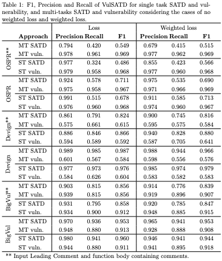

# Leveraging multi-task machine learning to improve vulnerability detection

This repository contains the replication package for the extended abstract *Leveraging multi-task machine learning to improve vulnerability detection*. The work was conducted by Barbara Russo, Jorge Melegati, and Moritz Mock.

Link to preprint: currently under review

## Abstract

Multi-task learning is a paradigm that leverages information of related tasks to improve the performance of machine learning. Self-Admitted Technical Debt (SATD) are comments in the code that indicate not-quite-right code introduced for short-term needs, i.e., technical debt. Previous research has provided evidence of a possible relationship between SATD and the existence of vulnerabilities in the code.
In this work, we investigate if multi-task learning could leverage the information shared between SATD and vulnerabilities to improve the automatic detection of these issues.
To this aim, we implemented VulSATD, a deep learner that detects vulnerable and SATD code, based on CodeBERT, a pre-trained transformers model. We evaluated VulSATD on MADE-WIC, a fused dataset on different weaknesses of code, including SATD and vulnerabilities. We compared the results using single and multi-tasks approach obtaining no significant differences. Given that the fraction of SATD is low, we also examined if the use of a weighted loss could improve the results but the performance was similar.
Our results indicate that sharing the information about SATD and vulnerabilities could not improve the performance of the automatic detection of these issues.

The following table contains all the experiment combinations conducted, due to space limitations in the paper only selected parts are presented.



## Mutate dataset 

In the folder [scripts](scripts), the script for the mutation of the dataset MADE-WIC ([paper](https://doi.org/10.1145/3691620.3695348)) can be found.

## Annotation of 200 instances

In the folder [manual annotation](manual_annotation), the 200 extracted instances, 100 SATD and vulnerable and 100 SATD and not vulnerable, with the corresponding annotation can be found.

## How to replicate

The first step is to clone the repository locally with the following commands:

```
git clone git@github.com:moritzmock/multitask-vulberability-detection.git
cd multitask-vulberability-detection
```

We recommend the creation of a virtual environment, for example, using venv (the exact commands might need to be adapted according to your system):

```
python3 -m venv env
source env/bin/activate
```

Then, install the dependencies which are listed in the requirements.txt file. This can be done using `pip`:

```
pip install -r requirements.txt
```
To train the model, use the following command:

```
python main.py \
        --model=<satdonly|vulonly|multitask> \
        --mode=train \
        --dataset="path_to_<OSPR|Big-Vul|Devign>" \
        --comment-column="Comments" \
        --code-column="OnlyCode" \
        --store-weights=True \
        --weighted-loss=<True|False> \
        --output-dir="./stored_models"


```

To test the saved model, use the following command:

```
python main.py \
       --model=<satdonly|vulonly|multitask> \
       --mode=test \
       --dataset="path_to_<OSPR|Big-Vul|Devign>" \
       --comment-column="Comments" \
       --code-column="OnlyCode" \
       --model-file="./stored_models/weights_<satdonly|vulonly|multitask>_lr_2e-05_ne_10_bs_16_dp_0.1_l2_0.tf"
```
### Relevant parameters

In the following the two most relevant parameters for the experiments are described. Different combinations of them have been employed within the paper.

| Parameter      | Options | Description                                                                 |
|----------------|------|-----------------------------------------------------------------------------|
| model          | \<satdonly\|vulonly\|multitask\>    | Different modes leveraged during the experiments                            |
| weighted-loss  | \<True\|False\>                  | Flag indicating if the execution considered weighted loss or not            |


While setting the mode to "hyper-analysis" the hyperparameter search based on the values in the [hyperanalysis.yml](hyperanalysis.yml) are considered as search space.